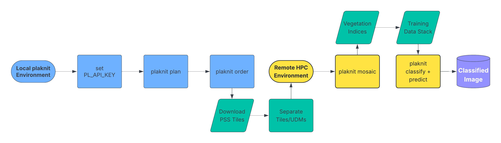

# 🧶 plaknit


[](https://pypi.python.org/pypi/plaknit)
[](https://anaconda.org/conda-forge/plaknit)


**Processing Large-Scale PlanetScope Data**

> Note: plaknit is fully operational as of v0.3.0. Continue to look for updates, and please share feedback or ideas through the GitHub Issues tab.

PlanetScope Scene (PSS) data are reveared for its quality and distinct ability to
balance spatial and temporal resolution in Earth Observation data. While PSS has
proven itself a valuable asset in monitoring small-scale areas, the literature
has pointed out the shortcomings when creating a single image from individual tiles
(Frazier & Hemingway, 2021).

`plaknit` bundles the workflow I use to operationalize large-area mosaics so
you can run the same process locally or in an HPC environment. The goal is to
spend time answering big questions, not making a big mess of your data.

- Free software: MIT License
- Documentation: https://dzfinch.github.io/plaknit

<p align="center">
  
</p>


## Features

- CLI + Python API that scale from local experimentation to HPC batch runs.
- Planning workflow that searches Planet's STAC/Data API and scores scenes, with ordering handled by a separate `plaknit order` workflow.
- GDAL-powered parallel masking of Planet strips with their UDM rasters.
- Tuned Orfeo Toolbox mosaicking pipeline with RAM hints for large jobs.
- Random Forest and Boosted Regression Tree ensemble training + inference utilities for classifying Planet stacks.

## Quick Start

### Train a BRT Ensemble Classifier

```bash
plaknit brt train \
  --image stack.tif \
  --labels training.gpkg \
  --label-column class_id \
  --output ./brt_ensemble/ \
  --n-models 5 \
  --gpu
```

### Apply the Ensemble to New Imagery

```bash
plaknit brt predict \
  --image new_stack.tif \
  --ensemble-dir ./brt_ensemble/ \
  --output-dir ./probability_outputs/ \
  --feature-importance-out predictor_importance.csv
```

See [Usage](https://dzfinch.github.io/plaknit/usage.html) for complete examples and all supported options.
