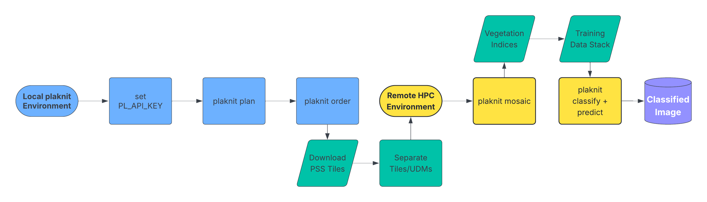

# Welcome to plaknit 🧶

**Processing Large-Scale PlanetScope Data**

-   Free software: MIT License
-   Documentation: <https://dzfinch.github.io/plaknit>

## Why plaknit exists

PlanetScope Scene (PSS) data are reveared for its quality and distinct ability to
balance spatial and temporal resolution in Earth Observation data. While PSS has
proven itself a valuable asset in monitoring small-scale areas, the literature
has pointed out the shortcomings when creating a single image from individual tiles
(Frazier & Hemingway, 2021).

`plaknit` bundles the workflow I use to operationalize large-area mosaics so
you can run the same process locally or in an HPC environment. The goal is to
spend time answering big questions, not making a big mess of your data.

  

## Features

-   Run everything from a single CLI (`plaknit`) that works cross-platform (plan, order, mosaic).
-   Plan PSScene acquisitions per month (`plaknit plan`), auto-simplify ROIs to Planet’s 1,500-vertex limit, and submit resilient Planet Orders (`plaknit order`).
-   Build seamless mosaics (`plaknit mosaic`) with pre-tuned Orfeo Toolbox parameters and RAM hints after masking PlanetScope tiles against their UDM rasters using efficient GDAL workflows.
-   Train and apply Random Forest classifiers with optional Bayesian Smoothing on multi-band stacks directly from CLI with `plaknit train` and `plaknit predict`.

## Need to run on HPC?

See [Running plaknit on HPC with Singularity/Apptainer](hpcenv.md) for a
copy-pasteable recipe that uses persistent virtual environments and SLURM batch
jobs inside containerized OTB builds.

